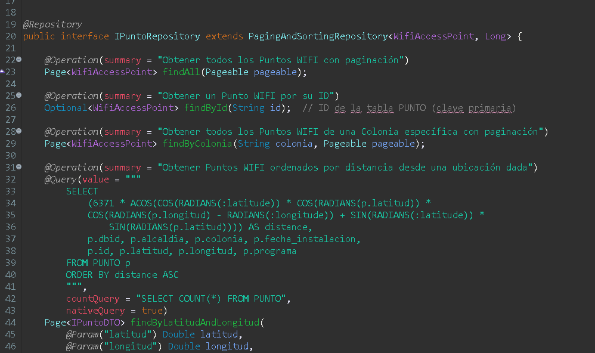
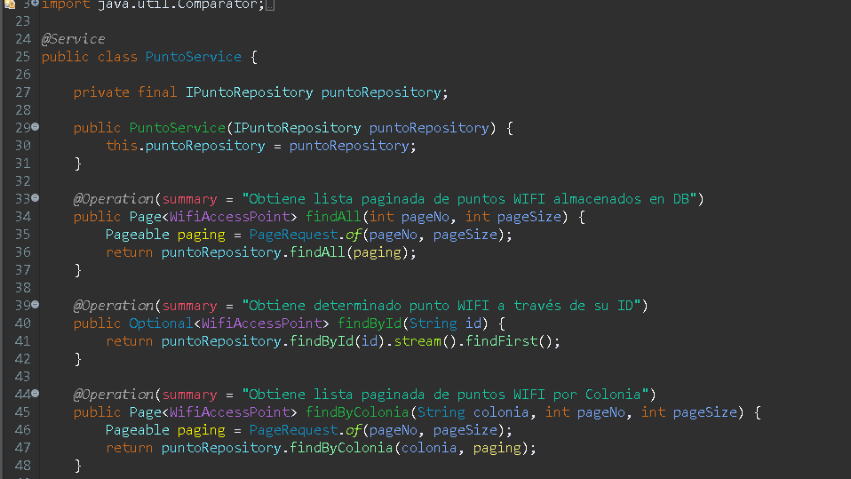
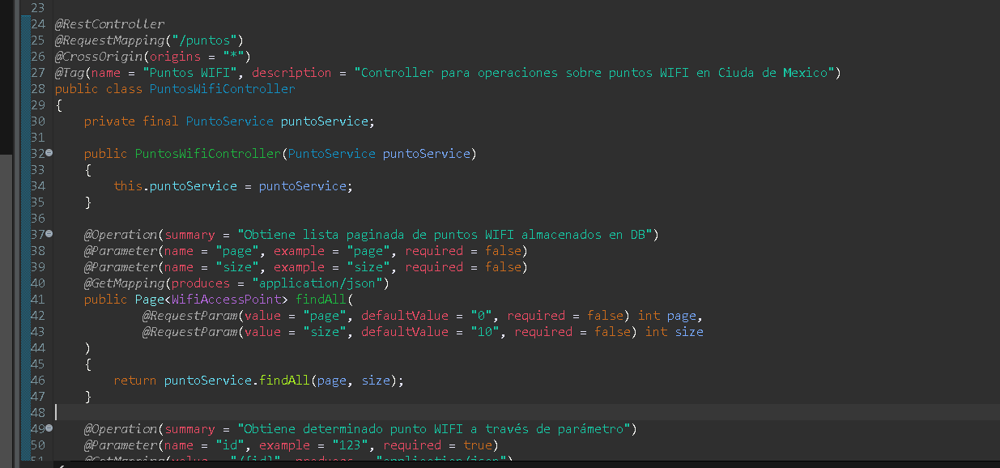
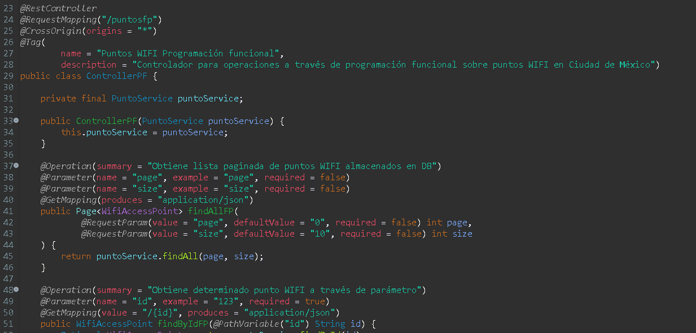
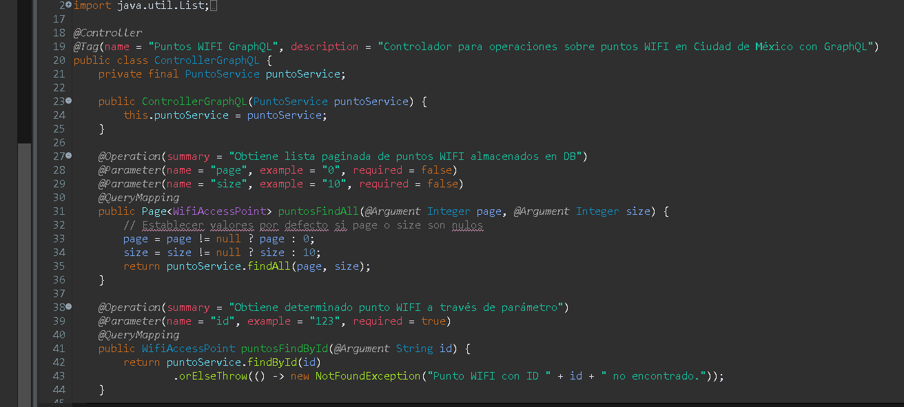
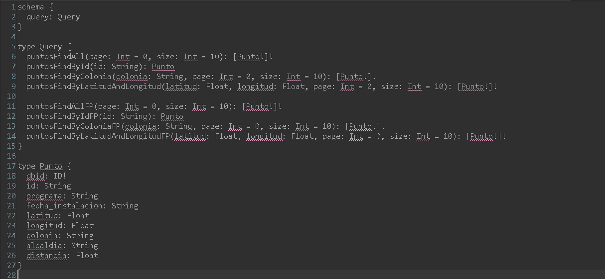
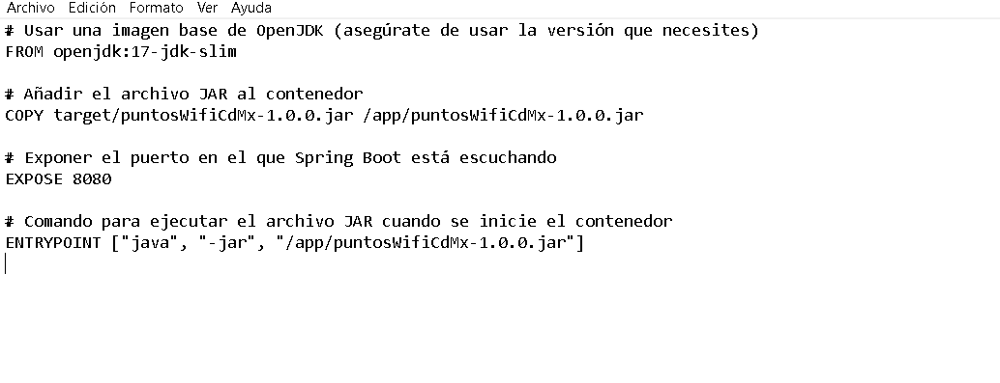
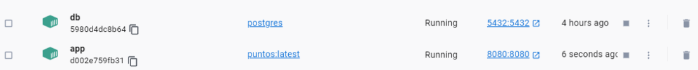
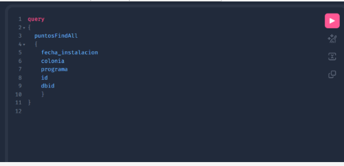

Prueba técnica: Data pipeline
 Descripción:
 Desarrollar un pipeline de análisis de datos utilizando los datos abiertos de la Ciudad de México correspondientes a las Puntos de acceso WiFi en la Ciudad de México para que pueda
 ser consultado mediante un API Rest.
 Introducción:
 Se desarrolla una API con diversas funciones para consulta la información almacenada, con el uso de Spring Boot 3.4

- Consultas REST
- Consultas GraphQL
- La BD se empaqueta en un contenedor
- La API se empaqueta en un contenedor

Programas utilizados:
-Springboot 2.7
-Java 17
-PostgreSQL
-Docker
-Github
-Maven project
-Spring Tool Suite 3

Dependencias utilizadas:
-lombok
-Graphql
-Openapi

DISEÑO:
La solución general es la siguiente:
wifi-api/
│── src/
│   ├── main/java/com/example/wifi/
│   │   ├── controller/   # Controladores GraphQL
│   │   ├── service/      # Lógica de negocio
│   │   ├── repository/   # Acceso a la base de datos
│   │   ├── model/        # Definición de entidades
│   │   ├── dto/          # Objetos de transferencia de datos
│   │   ├── config/       # Configuración de GraphQL y BD
│── resources/
│   ├── schema.graphqls   # Definición del esquema GraphQL
│   ├── application.yml   # Configuración de Spring Boot y BD
│── Dockerfile
│── docker-compose.yml
│── README.md
│── pom.xml

En dónde:

* Controller: para hacer que nuestras funciones sean visibles al exterior
* Service: la lógica del negocio
* Respository: el ente que nos permite manipular los modelos y accesar a la DB
* Model: la representacion de las entidades en la DB, Modelo Punto y 2 archvios DTO para 1 Proyeccion JPA y el otro como auxiliar para calculo, no es necesario estos, pero estan para ejemplificar las diferentes formas de operar o realizar una solucion.

MODELO

La clase WifiAcessPoint contiene los atributos de los puntos de acceso en la CDMX, por lo tanto se representa de este modo


**Repository**

Es una interfaz que extiende `<span>PagingAndSortingRepository</span>`, lo que significa que hereda métodos para operaciones CRUD (Crear, Leer, Actualizar, Eliminar) y paginación sobre la entidad `<span>WifiAccessPoint</span>`.

Las anotaciones `@Operation` están presentes para agregar una descripción o resumen de lo que hace cada método, generalmente usadas para generar documentación automática como Swagger.



**Service**

Esta clase proporciona los servicios que encapsulan la lógica del negocio relacionada con los puntos WIFI y utiliza `<span>IPuntoRepository</span>`para interactuar con la base de datos.

* `findAll(int pageNo, int pageSize)`:
  * Obtiene una lista paginada de todos los puntos WIFI almacenados en la base de datos.
  * Usa `PageRequest.of(pageNo, pageSize)` para especificar la página y el tamaño de la página.
  * Retorna un `Page<WifiAccessPoint>`.
* `findById(String id)`:
  * Obtiene un punto WIFI específico por su ID.
  * Utiliza `puntoRepository.findById(id).stream().findFirst()` para buscar el punto en el repositorio y retornar un `Optional<WifiAccessPoint>`.
* `findByColonia(String colonia, int pageNo, int pageSize)`:
  * Obtiene una lista paginada de puntos WIFI en una colonia específica.
  * Usa `PageRequest.of(pageNo, pageSize)` para especificar la paginación.
  * Retorna un `Page<WifiAccessPoint>`.
* `findByLatitudAndLongitud(double latitud, double longitud, int pageNo, int pageSize)`:
  * Obtiene una lista paginada de puntos WIFI ordenados por distancia desde una ubicación específica (latitud y longitud).
  * Utiliza `PageRequest.of(pageNo, pageSize)` para la paginación.
  * Retorna un `Page<IPuntoDTO>`.
* `findByLatitudAndLongitudFP(double latitud, double longitud, int pageNo, int pageSize)`:
  * Versión funcional optimizada que obtiene una lista paginada de puntos WIFI en orden de menor a mayor distancia desde una ubicación específica.
  * Usa Streams para procesar la lista de puntos y calcular las distancias.
  * Ordena los puntos por distancia, aplica paginación y retorna una lista `List<WifiAccessPoint>`.
* `calcularDistancia(WifiAccessPoint punto, double latitud, double longitud)`:
  * Método auxiliar que calcula la distancia entre un punto WIFI y una ubicación específica utilizando la fórmula de la distancia euclidiana.

    

Controller

Existen 3 archivos de controlador, los cuales

- PuntosWifiController, es el controlador clasico REST, este controlador proporciona una API RESTful para acceder y gestionar los puntos WIFI, utilizando los métodos del `PuntoService` para implementar la lógica del negocio



ControllerPF, es un controlador REST que maneja las solicitudes HTTP relacionadas con los puntos WIFI utilizando programación funcional



PuntoControllerGQ, es el controlador para hacer uso de GraphQL



El Schema para GraphQl:




Para la parte de Docker realizamos un dockerfile: 



Posteriormente creamos la imagen tanto de nuestra db como de nuestra app




> http://localhost:8080/puntos?page=0&size=20


2. Busqueda por ID con GraphQL

> http://localhost:8080/graphql

```
query 
{
    puntosFindByIdFP
    #puntosFindById
    (  
        id: "7"
    )
    {
        dbid
        id
        programa
        fecha_instalacion
        latitud
        longitud
        colonia
        alcaldia
        distancia
    }
}
```


3. Busqueda por Colonia con programacion funcional, paginado

> http://localhost:8080/puntosfp/colonias/MEXICO?page=0&size=2


3. Busqueda por cercania [lat:long], servicio expuesto con GraphQL y logica realizada con programación funcional

> http://localhost:8080/graphql

```
query 
{
    puntosFindByLatitudAndLongitudFP
    #puntosFindByLatitudAndLongitud
    (  
        latitud: 19.4443523
        longitud: -99.1307745
        page: 0
        size: 5
    )
    {
        dbid
        id
        programa
        fecha_instalacion
        latitud
        longitud
        colonia
        alcaldia
        distancia
    }
}
```


En GraphQl:

http://localhost:8080/graphiql


